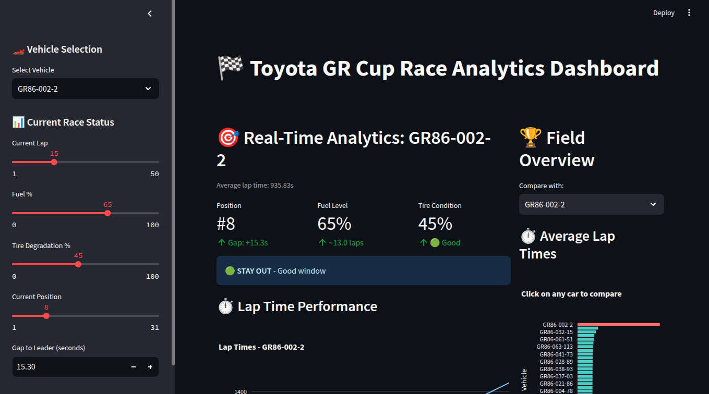
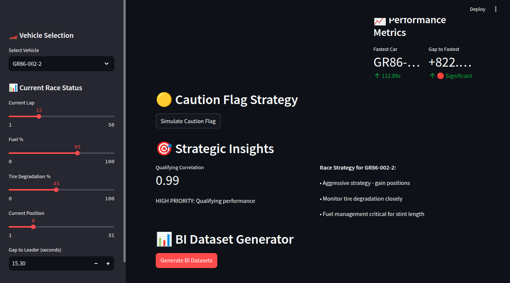

# 🏁 Toyota GR Cup Race Analytics Dashboard
The Pulse of the Track: Comprehensive Race Data Visualization.

> **Data Driven. Race Ready.** > An interactive telemetry and strategy tool designed to optimize race performance in real-time.



## 🚀 Live Dashboard

**[📊 Access the Interactive Race Analytics Dashboard](https://toyota-gr-cup-race-analytics-dashboard-55v9xepvxv94ejyhxlz6up.streamlit.app/)**

Explore real-time race strategy, pit stop optimization, and performance analytics through our interactive Streamlit dashboard.

---

## 📖 Overview
This dashboard provides race engineers and strategists with a centralized hub for monitoring vehicle performance during the Toyota GR Cup. By visualizing critical metrics like tire degradation, fuel levels, and lap times, the application helps teams determine the optimal pit strategy and compare their pace against specific rivals in the field.

## 🌟 Key Features

### 1. Real-Time Status Monitoring
- **Live Telemetry:** Instant visualization of current Position, Fuel Level (%), and Tire Condition.
- **Gap Analysis:** dynamic tracking of the time gap to the race leader.
- **Health Indicators:** Color-coded metrics (Green/Red) to indicate vehicle health and resource status.

### 2. Strategic Decision Support
- **Pit Window Logic:** Automated alerts (e.g., "🟢 STAY OUT - Good window") based on current tire/fuel metrics and field position.
- **Resource Estimation:** Calculates estimated laps remaining based on current fuel load.

### 3. Comparative Analytics
- **Rival Comparison:** Select any car on the grid to compare lap times and splits directly against your focused vehicle.
- **Field Overview:** A "Average Lap Times" bar chart to visualize where the current vehicle stands compared to the pace of the entire grid.
- **Performance Trends:** Line charts tracking lap time consistency over the duration of the race.

### 4. Interactive Simulation (Sidebar)
- Fully interactive controls to manually adjust race variables (Current Lap, Fuel %, Tire Deg %, Position) to simulate different race scenarios and test strategy logic.

## 🛠️ Tech Stack
* **Core:** Python
* **Frontend/UI:** Streamlit
* **Data Manipulation:** Pandas / NumPy
* **Visualization:** Altair / Plotly

## 🚀 How to Run
1. Clone the repository.
2. Install dependencies:
   ```bash
   pip install -r requirements.txt
3. streamlit app
    ```bash
   streamlit run streamlit_race_app.py
